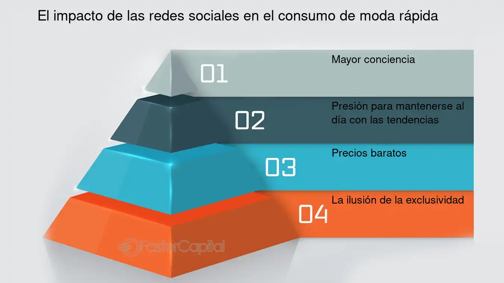

# La Moda y su Influencia en las Redes Sociales

La moda siempre ha sido una forma de expresion, pero con la llegada de las redes sociales, se ha convertido en un fenomeno global. Hoy, Instagram, TikTok y Pinterest marcan tendencias incluso mas que las pasarelas tradicionales.

## Influencers y Estilo

Los influencers juegan un papel fundamental: personas comunes pueden transformarse en referentes de estilo con solo un celular y una buena capacidad para crear contenido visual atractivo.

- Marcan tendencias con sus outfits diarios.
- Promocionan marcas mediante colaboraciones.

[Ver perfil de Sofia Gonet](https://www.instagram.com/sofiagonet?igsh=dWpuc2NsbjE1d2o3)

## Rol de TikTok

TikTok ha revolucionado la manera en que se viralizan las modas. Desde prendas especificas hasta esteticas completas (como "Y2K", "coquette", "old money", "clean girl" o "e-girl"), todo puede popularizarse en segundos.

- Crea retos de moda (fashion challenges).
- Viraliza microtendencias con musica y edicion.

[Descubri una de las ultimas tendencias en TikTok](https://vm.tiktok.com/ZMBEXGwW4/)

## Moda Rapida y Consumo

El deseo constante de "estar a la moda" impulsa el consumo de ropa barata y de corta duracion, fenomeno conocido como fast fashion.

- Aumentan las compras impulsivas motivadas por las tendencias virales.
- Se generan grandes cantidades de desechos textiles y contaminacion.

[Articulo sobre fast fashion](https://cnnespanol.cnn.com/2023/11/25/que-es-fast-fashion-moda-rapida-trax)

## Estetica y Algoritmo

Las redes sociales favorecen el contenido visualmente atractivo. Cuanto mas estetico, cuidado y coherente sea el estilo de una publicacion, mas probabilidades tiene de viralizarse. Esta logica algoritmica tambien impacta en la forma en que las personas eligen vestirse.

- Los colores y estilos "de moda" se replican en miles de perfiles.
- Muchos looks se piensan unicamente para la foto, no para la vida cotidiana.

[Como el algoritmo afecta la moda](https://www.infobae.com/opinion/2024/01/26/los-algoritmos-en-las-pasarelas-de-la-moda/) 

##Feed de Instagram que impone moda

 

