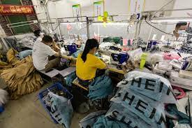
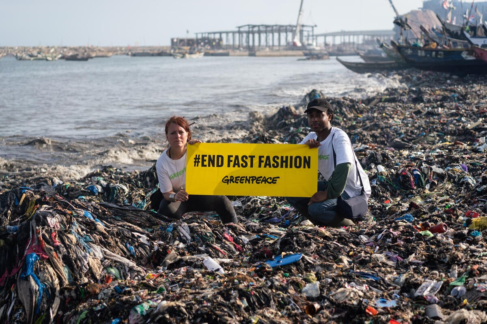
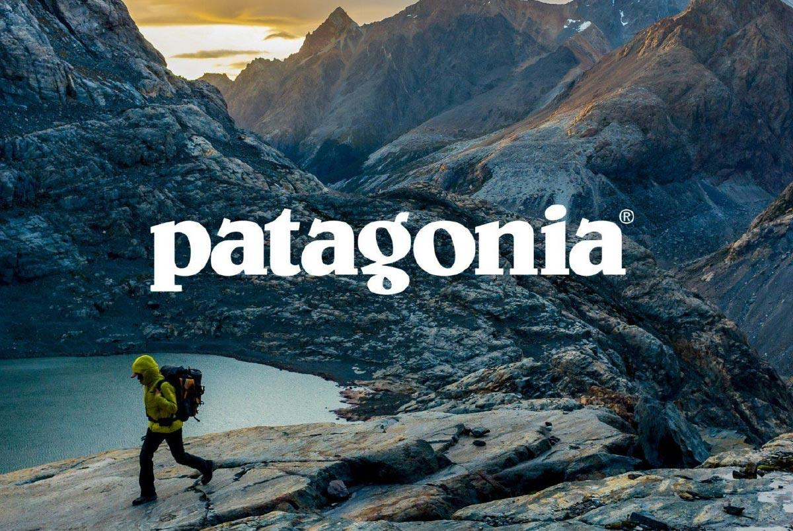

#  🌍 Moda rápida y sostenibilidad
## ¿Qué es la moda rápida?

La **moda rápida**, o mejor conocida como *fast fashion*, es un modelo de producción y consumo que se basa en la creación de ropa barata, de baja calidad y en grandes cantidades. 

Este sistema permite que las **tendencias** cambien rápidamente y que las prendas se descarten con la misma velocidad.

## ¿En qué consiste?

- Producción masiva y rápida de prendas. 
- Diseños copiados y plagios→ pasarelas y grandes marcas.
- Costos bajos para el consumidor→ altos para el planeta. 

*PROBLEMA*: este modelo **exige grandes cantidades de recursos naturales**, genera residuos textiles y **explotación laboral** en países en vías de desarrollo. Como **Vietnam, China, India, Filipinas.**

## Impacto ambiental y social 

- Contaminación del agua con tintes y microplásticos. 
- Alta huella de carbono debido al transporte y producción.
- Condiciones laborales precarias en fábricas de países con bajos recursos. 
- Desecho rápido→ toneladas de ropa terminan en vertederos→ **cultura del consumismo**

**Algunas empresas** que se caracterizan por su elaboración poco sostenible son:

- Shein
- Zara
- H & M 

## 👗 La moda sostenible 

Busca crear un equilibrio entre el estilo, la ética y el medioambiente. Algunas de sus características son:

- Uso de materiales reciclados o ecológicos. 
- Producción ética, con salarios justos y condiciones seguras. 
- Ropa duradera, atemporal y de mejor calidad. 
- Promoción del consumo consciente

## ✅ ¿Qué podes hacer vos?

- Elegir prendas de calidad por sobre cantidad y precio. Permite extender la vida útil de la prenda.
- Reutilizar, reparar y **donar ropa**.
- Apoyar marcas sostenibles y locales. 
- Informarse a la hora de consumir y compartir el mensaje. 

**Algunas empresas** que destacan por su cuidado medioambiental, son:

- Patagonia (Argentina)
- People Tree
- Ecoalf
- Nudie Jeans 

