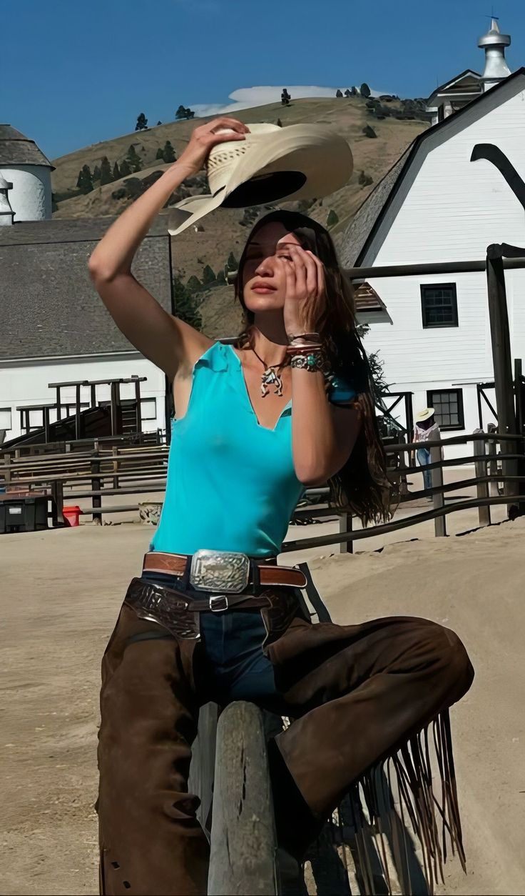
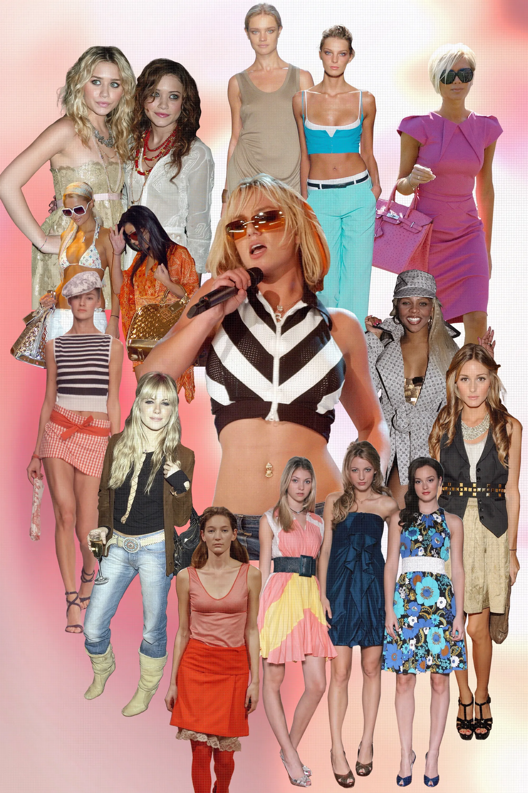
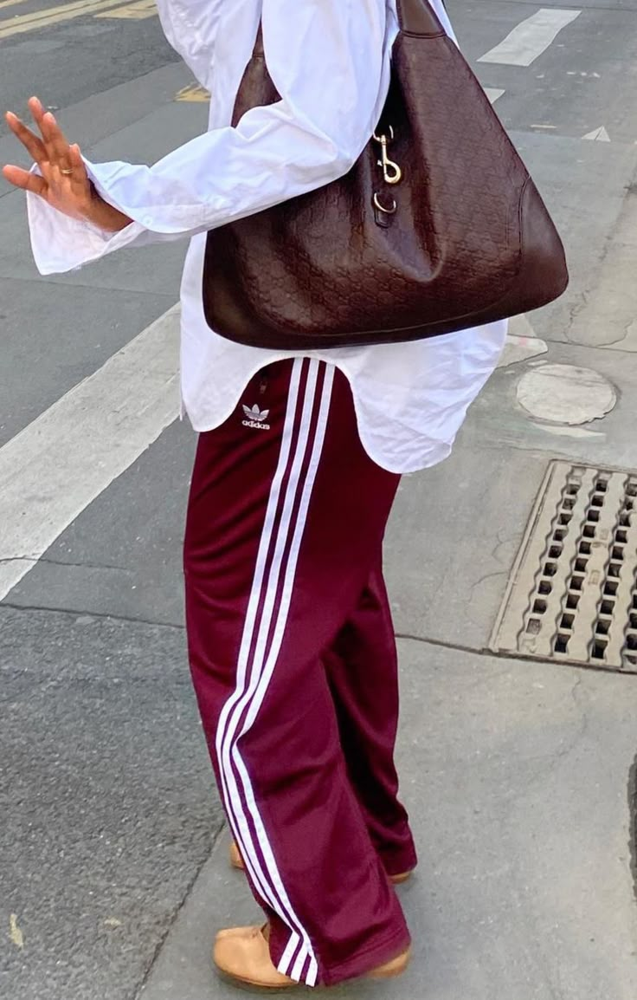

# Trends 2025

# Boho chic style
Es un estilo que mezcla lo contemporaneo con lo clásico. ¡Los flecos, el crochet y las prendas artesanales son esenicales!
## Prendas claves: 
- Chalecos (con detalles bordados)
- Carteras con flecos
- Sombrero de red, collares largos, cinturones 
- Botas texanas
- Paleta cálida: Tonos tierra, beige, oliva

# Y2K revival
## **La vuelta de la moda de los 2000**
### Características del Y2K: 
- Pantalones tiro bajo 
- Tops con cortes asimétricos
- Muchos accesorios: cinturones con hebillas grandes, anteojos, carteras
- Colores brillantes, telas metálicas, estampados

Más información:
- [Y2K Fashion](https://www.vogue.com/article/y2k-fashion)
- [Moda de los 2000](https://www.vogue.mx/articulo/moda-de-los-2000)

# Athleisure 
Esta moda combina prendas deportivas con vestimenta más elegante/casual.
## Prendas necesarias:
- Blazers/trench coats
- Pantalones sastreros
- Camisas oversize
- Zapatillas deportivas 
- Leggins deportivos / pollera de tenis / short deportivos

Inspo: 
- [Último en tendencia](https://www.cosmopolitan.com/es/moda/novedades-moda/g63950565/estilo-athleisure-tendencia-looks-primavera-2025/)
- [Ideas](https://www.vogue.es/articulos/adios-leggings-nuevo-athleisure-shorts-retro-camiseta-vintage)

# Clean girl aesthetic
Este movimiento va más allá de la ropa. Se relaciona al minismilismo, enfatizando la simplicidad. Entre sus caracteristícas se destacan: 
- Maquillaje natural 
- Tonos neutros
- Pocos accesorios 
- Prendas clásicas 

Una de las representantes de esta moda es Hailey Bieber: 

Para más información de esta tendencia: [Link](https://www.vogue.co.uk/article/clean-girl-aesthetic-trend)
